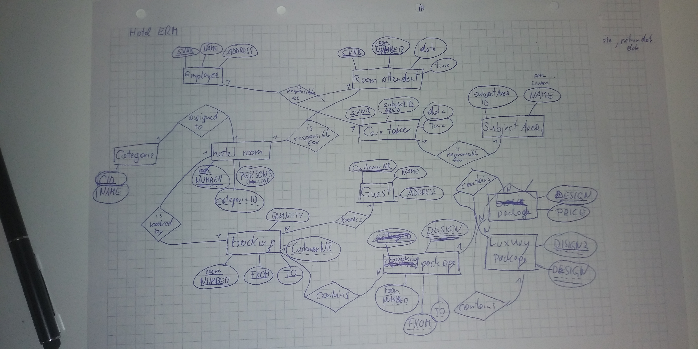
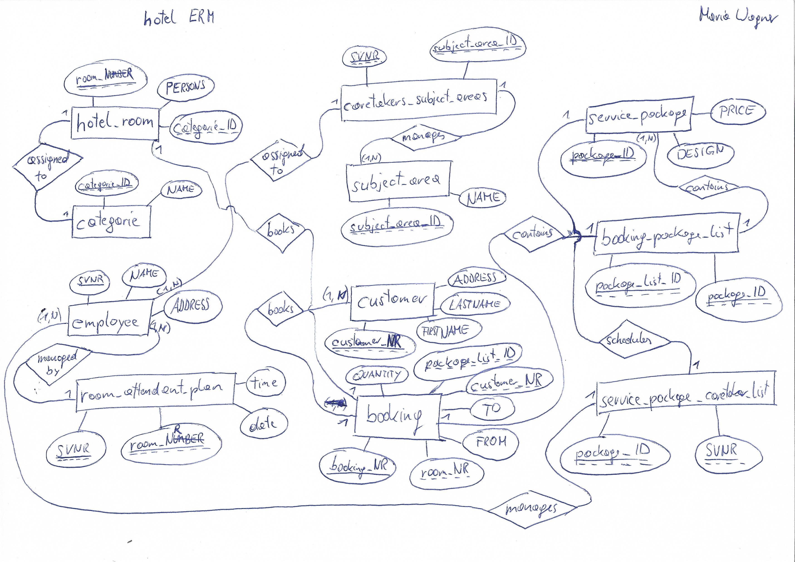
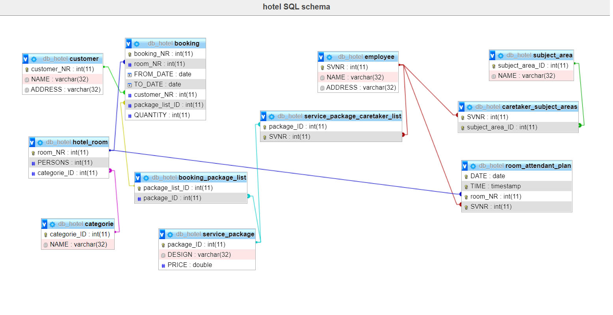

# Hotel-ERM

A database has to be implemented for a hotel business. Draw the following facts in an ER diagram 
in Chen notation and create a relational model No zero values are allowed. Use the attribute 
names in brackets.
Hotel rooms are uniquely identified by a number (NUMBER). It is also stored whether it is a 
single room or a double room (PERSONS). Each room is assigned to a category. Categories have 
a unique ID (ID) and a description (NAME).
Employees are identified by a unique social security number (SVNR). Name (NAME) and address 
(ADDRESS) of the employee are also known. Room attendants and caretakers are employees. The 
system stores which room is cleaned by which room attendant. For caretakers, a subject area 
(e.g. sauna, masseur, swimming pool, kitchen, ...) is also stored.
A guest has a unique customer number (CustomerNR), a name, (NAME) and an address (ADDRESS). 
A guest can make several bookings. A booking depends on the room and on a date of arrival 
(FROM) and departure (TO).
The hotel also offers service packages. A unique designation (DESIGN) and a price (PRICE) 
are stored. There are basic packages and luxury packages. A luxury package contains at 
least one or more basic packages. Any number of different service packages can be ordered 
for each booking, whereby the quantity ( QUANTITY) must also be noted. For each service 
package, one or more carers are responsible.

## first solution

### textual notation:

* hotel rooms(**roomNUMBER:int**, PERSONS:int, categorieID:int) <br>

* categorie(**categorieID:int**, NAME:varchar(32)) <br>

* employee(**SVNR:int**, NAME:varchar(32), ADDRESS:varchar(32)) <br>
 
* Room attendant(**SVNR:int**, NUMBER:int, date:date, time:timestamp) <br>
  
* caretaker(**SVNR:int**, subjectAreaID:int, DESIGN:varchar(32)) <br>

* subject area(**subjectAreaID:int**, NAME:varchar(32) ) <br>
  
* guest(**CustomerNR:int**, NAME:varchar(32), ADDRESS:varchar(32)) <br>

* booking(***roomNUMBER:int***, ***FROM:date***, ***TO:date*** , CustomerNR:int, packageID:int, QUANTITY:int) <br>

* basic package(**DESIGN:varchar(32)**, PRICE:double) <br>

* luxury package(**DESIGN:varchar(32)**, ***DESIGN:varchar(32)***)   <br>

* booking package(**packageID:int**, DESIGN:varchar(32)) <br>
 
#### own ERM:



## second solution

### ERM:



### textual notation:

* hotel_room(**room_NR**:int(11), PERSONS:int(11), *categorie_ID*:int(11))

* categorie(**categorie_ID**:int(11), NAME:varchar(32))

* employee(**SVNR**:int(11), NAME:varchar(32), ADDRESS:varchar(32))
 
* room_attendant_plan(***date***:date, ***time***:timestamp , ***room_NR***:int, *SVNR*:int(11))
  
* caretaker_subject_areas(***SVNR***:int(11), ***subject_area_ID***:int(11))

* subject_area(**subject_area_ID**:int(11), NAME:varchar(32))
  
* customer(**customer_NR**:int(11), NAME:varchar(32), ADDRESS:varchar(32))

* booking(**booking_NR**:int(11), *room_NR*:int(11),  FROM_DATE:date, TO_DATE:date, *customer_NR*:int(11), *package_list_ID*:int(11), QUANTITY:int(11))

* service_package(**package_ID**:int(11), DESIGN:varchar(32), PRICE:double)

* service_package_caretaker_list(***package_ID***:int(11), ***SVNR***:int(11))

* booking_package_list(**package_list_ID**:int(11), *package_ID*:int(11))


### SQL Code:

[SQL File Link](db_hotel.sql)

```
CREATE TABLE hotel_room( room_NR int(11), PERSONS int(11), categorie_ID int(11), PRIMARY KEY(room_NR));

CREATE TABLE categorie( categorie_ID int(11), NAME varchar(32), PRIMARY KEY(categorie_ID));

CREATE TABLE employee( SVNR int(11), NAME varchar(32), ADDRESS varchar(32), PRIMARY KEY(SVNR));
 
CREATE TABLE room_attendant_plan( DATE date, TIME timestamp, room_NR int, SVNR int(11), PRIMARY KEY(DATE, TIME, room_NR));
  
CREATE TABLE caretaker_subject_areas( SVNR int(11), subject_area_ID int(11), PRIMARY KEY(SVNR, subject_area_ID));

CREATE TABLE subject_area( subject_area_ID int(11), NAME varchar(32), PRIMARY KEY(subject_area_ID));
  
CREATE TABLE customer( customer_NR int(11), NAME varchar(32), ADDRESS varchar(32), PRIMARY KEY(customer_NR));

CREATE TABLE booking( booking_NR int(11), room_NR int(11), FROM_DATE date, TO_DATE date, customer_NR int(11), package_list_ID int(11), QUANTITY int(11), PRIMARY KEY(booking_NR));

CREATE TABLE service_package( package_ID int(11), DESIGN varchar(32), PRICE double, PRIMARY KEY(package_ID));

CREATE TABLE service_package_caretaker_list( package_ID int(11), SVNR int(11), PRIMARY KEY(package_ID, SVNR));

CREATE TABLE booking_package_list( package_list_ID int(11), package_ID int(11), PRIMARY KEY(package_list_ID));
```
### SQL Schema:



